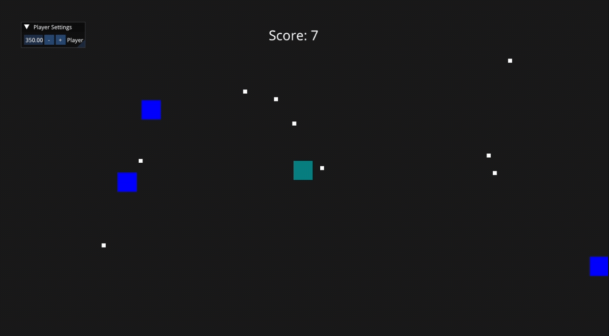



{}
From the beginning, the goal was clear: I wanted to learn how to build an engine, not just how to render a triangle. That distinction matters more than it sounds.
{}

{}
Desde el principio, el objetivo era claro: quería aprender a construir un motor, no solo a renderizar un triángulo. Esa distinción importa más de lo que parece.
{}

---

{}
## A proper engine, not just a triangle

Having worked with OpenGL and SDL2 before, I wasn't starting from zero. I knew how to open a window, send vertices to the GPU, and get something on screen. What I didn't know was how to turn that knowledge into an actual engine — something with architecture, a lifecycle, and a surface clean enough for someone to build a game on top of.

Most tutorials stop at the triangle. They explain the graphics pipeline well, but once you can draw a colored shape, the tutorial ends. You're left with a `main` function full of raw API calls and no idea how to grow it into anything real.

That's where TheCherno's Hazel Engine series stood out. Instead of ending at the triangle, it kept going — asking the questions that tutorials skip: how do you separate engine code from game code? How do you build a layer system? How do you abstract rendering away from any specific backend? It didn't hand over all the answers, but it pointed in the right direction. That was enough.
{}

{}
## Un motor de verdad, no solo un triángulo

Habiendo trabajado con OpenGL y SDL2 antes, no estaba empezando de cero. Sabía cómo abrir una ventana, mandar vértices a la GPU y mostrar algo en pantalla. Lo que no sabía era cómo convertir ese conocimiento en un motor real — algo con arquitectura, un ciclo de vida y una superficie lo suficientemente limpia como para que alguien construya un juego encima.

La mayoría de los tutoriales se detienen en el triángulo. Explican bien el pipeline gráfico, pero una vez que podés dibujar una forma con color, el tutorial termina. Te quedás con una función `main` llena de llamadas crudas a la API y sin idea de cómo hacerlo crecer en algo real.

Ahí es donde la serie de Hazel Engine de TheCherno se destacó. En lugar de terminar en el triángulo, seguía — haciendo las preguntas que los tutoriales se saltan: ¿cómo separás el código del motor del código del juego? ¿Cómo construís un sistema de capas? ¿Cómo abstraés el rendering de cualquier backend específico? No entregaba todas las respuestas, pero apuntaba en la dirección correcta. Con eso alcanzaba.
{}

---

{}
## A tool in the wild

Something I didn't expect was how quickly the engine would get used for something real. While I was still in the middle of following the series, I was taking a subject at university that required interactive simulations. I thought: why not build them with this?

It worked. Rough around the edges, missing features everywhere — but it ran, it drew things on screen, and it handled input. Seeing a tool I had written from scratch being used to get something done was genuinely moving. I remember thinking this must be a small taste of what it feels like to ship something that another person actually uses. Even if that person was me submitting a homework assignment.
{}

{}
## Una herramienta en acción

Algo que no esperaba era lo rápido que el motor iba a ser usado para algo real. Mientras todavía seguía la serie a la mitad, estaba cursando una materia en la universidad que requería simulaciones interactivas. Pensé: ¿por qué no construirlas con esto?

Funcionó. Con las aristas sin pulir, con funcionalidades faltando por todos lados — pero corría, dibujaba cosas en pantalla y manejaba input. Ver una herramienta que yo había escrito desde cero siendo usada para hacer algo fue genuinamente emocionante. Recuerdo haber pensado que eso debía ser un pequeño sabor de lo que se siente entregar algo que otra persona realmente usa. Aunque esa persona fuera yo entregando una tarea.
{}

---

{}
## The Application

The first real architectural decision was how to separate the engine from the game. The solution is clean in hindsight: the engine defines an `Application` class that owns the window, the event system, and the main loop. The game code lives in a subclass that inherits from it. Critically, the entry point belongs to the engine — the game just provides an instance of itself and hands control over.

```cpp
// EntryPoint.h
extern cbk::Application* cbk::createApplication();

int main(int argc, char** argv) {
	cbk::Logger::init();
	auto app = cbk::createApplication();
	app->Run();
	delete app;
}

// Application.h - function defined outside Application class
Application* createApplication();

// SandboxApplication.h
class Sandbox : public Application {
  public:
	Sandbox() {
		pushLayer(new ExampleLayer()); // The example layer will have the gameplay code
	}
};

Application* cbk::createApplication() {
	return new Sandbox();
}

```

This way the game never has to manage `main`. It just says what it is, and the engine takes care of the rest.

The main loop also introduced the concept of layers. Instead of letting the application monolithically update everything, all logic is pushed onto a layer stack. Each frame, the engine calls `OnUpdate` on every layer in order. Then, in a second pass over the same stack, it calls `OnImGuiRender` — so debug UI always renders on top, no matter what the layers below are doing.

```cpp
for (Layer* layer : m_LayerStack)
    layer->onUpdate(timestep);

m_ImGuiLayer->begin();
for (Layer* layer : m_LayerStack)
    layer->onImGuiRender();
m_ImGuiLayer->end();	
```

It's a simple idea, but it made the engine composable in a way that would matter a lot later.
{}

{}
## La Aplicación

La primera decisión arquitectónica real fue cómo separar el motor del juego. La solución es clara en retrospectiva: el motor define una clase `Application` que es dueña de la ventana, el sistema de eventos y el loop principal. El código del juego vive en una subclase que hereda de ella. Lo importante es que el entry point le pertenece al motor — el juego simplemente provee una instancia de sí mismo y cede el control.

```cpp
// EntryPoint.h
extern cbk::Application* cbk::createApplication();

int main(int argc, char** argv) {
	cbk::Logger::init();
	auto app = cbk::createApplication();
	app->Run();
	delete app;
}

// Application.h - function defined outside Application class
Application* createApplication();

// SandboxApplication.h
class Sandbox : public Application {
  public:
	Sandbox() {
		pushLayer(new ExampleLayer()); // The example layer will have the gameplay code
	}
};

Application* cbk::createApplication() {
	return new Sandbox();
}

```

De esta forma el juego nunca tiene que manejar el `main`. Solo dice lo que es y el motor se encarga del resto.

El loop principal también introdujo el concepto de capas. En lugar de dejar que la aplicación actualice todo monolíticamente, toda la lógica se apila en un stack de capas. Cada frame, el motor llama a `OnUpdate` en cada capa en orden. Luego, en un segundo recorrido por el mismo stack, llama a `OnImGuiRender` — así la UI de debug siempre se renderiza encima, sin importar lo que las capas de abajo estén haciendo.

```cpp
for (Layer* layer : m_LayerStack)
    layer->onUpdate(timestep);

m_ImGuiLayer->begin();
for (Layer* layer : m_LayerStack)
    layer->onImGuiRender();
m_ImGuiLayer->end();	
```

Es una idea simple, pero haría al motor componible de una manera que importaría mucho más adelante.
{}

---

{}
## The Renderer

Then came the part I was most interested in: the renderer.

The design that appealed to me was a two-level split. On top, a high-level `Renderer` — the surface the engine user ever touches. Below it, a `RendererAPI` interface that hides all the backend-specific work. The idea is that you can slot in a different backend (Vulkan, Metal, DirectX) without any of the user-facing code changing.

After the previous chapter of working directly with OpenGL, implementing the `OpenGLRendererAPI` felt natural — almost like connecting dots I'd already placed. What I found most satisfying was abstracting the core GPU primitives: a `VertexBuffer`, an `IndexBuffer`, and a `VertexArray` that ties them together into a drawable unit. Each one a small object with a clean interface, hiding all the OpenGL state underneath.

Putting it all together and seeing a textured quad on screen for the first time was one of those moments that makes the whole project worth it.



But it was also the moment I started asking questions I didn't have answers to yet. Was this `Renderer` interface actually clean enough for someone building a game on top of it? And more importantly — would it hold up if I plugged in a different backend? Looking at it honestly, everything felt a little too tailored to OpenGL for my comfort. I'd need to find out.
{}

{}
## El Renderer

Después llegó la parte que más me interesaba: el renderer.

El diseño que me atrajo fue una división en dos niveles. Arriba, un `Renderer` de alto nivel — la superficie que el usuario del motor toca. Por debajo, una interfaz `RendererAPI` que oculta todo el trabajo específico del backend. La idea es que se puede cambiar el backend (Vulkan, Metal, DirectX) sin que nada del código del usuario cambie.

Después del capítulo anterior trabajando directamente con OpenGL, implementar el `OpenGLRendererAPI` se sintió natural — casi como conectar puntos que ya había colocado. Lo que más me satisfizo fue abstraer las primitivas centrales de la GPU: un `VertexBuffer`, un `IndexBuffer` y un `VertexArray` que los une en una unidad dibujable. Cada uno un objeto pequeño con una interfaz limpia, ocultando todo el estado de OpenGL por debajo.

Juntar todo y ver por primera vez un quad con textura en pantalla fue uno de esos momentos que hacen que valga la pena todo el proyecto.


Pero también fue el momento en que empecé a hacerme preguntas que todavía no tenía respuestas. ¿Era esta interfaz `Renderer` realmente lo suficientemente limpia para alguien construyendo un juego encima? Y más importante — ¿aguantaría si enchufaba un backend diferente? Mirándolo con honestidad, todo se sentía un poco demasiado adaptado a OpenGL para mi gusto. Tendría que averiguarlo.
{}

---

{}
*Next: Batch Rendering — how I rewrote the renderer to draw hundreds of sprites in a single draw call, and what I had to unlearn to get there.*
{}

{}
*Siguiente: Batch Rendering — cómo reescribí el renderer para dibujar cientos de sprites en un solo draw call, y qué tuve que desaprender para lograrlo.*
{}
